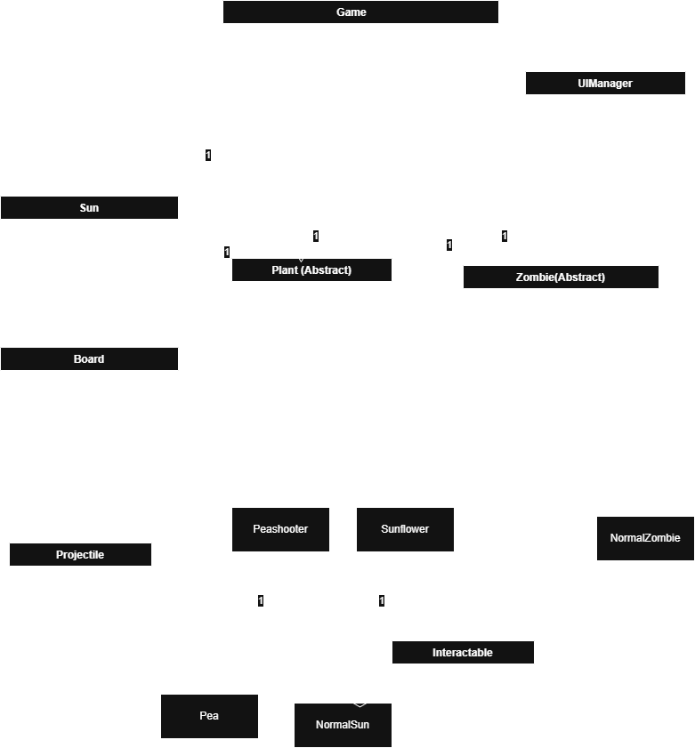

Period 5
Mottaqi Abedin and Leilah Yik
\[group name]

# Technical Details:

A description of your technical design. This should include:

How you will be using the topics covered in class in the project.

We will be creating our version of Plants vs Zombies, which is a tower defense game where players have to use plants to defend their house from an onslaught of zombies. Unfortunately, due to the existing game's complexity, we will have to dumb it down by reducing the varieties of plants and zombies, and we will not be adding features like powerups from Plants vs Zombies 2.

After 1.5 weeks, we want to have added the Sunflower, Peashooter, and Normal Zombie. They should all function as intended (sunflowers should generate collectible sun, peashooters should launch ranged attacks, normal zombies should eat plants and trigger a defeat screen when they reach the house). At this point in time, we should have at least one playable level.

By the end, it would be nice to have added more plant and zombie types (e.g. walnut, repeater, torchwood, conehead zombie, buckethead zombie, screen door zombie, imp), natural sun generation, lawnmowers, the shovel feature, and sprites/animations for plant and zombie statuses (attacking, eating/being eaten, injured, etc.).It would also be nice to have a start/level selection screen and an endless mode. If we're ambitious, we could also add the last stand mode, where the player starts with a set amount of sun and has to plan their defense to defeat the zombies.

Some things we will use that we have learned from class are interfaces and classes.

# Project Design

UML Diagrams and descriptions of key algorithms, classes, and how things fit together.

Updated (more recently) UML:
https://drive.google.com/file/d/1-tczdxmiCW5nYJZR1coj2HWbhy9O71B7/view?usp=sharing

Updated UML:

Old UML:

# Intended pacing:

How you are breaking down the project and who is responsible for which parts.

**WEEK 1 (FINISH BEFORE 5/27)**
- Board logic and mouse input (Leilah)
  - Draw a 5 x 9 lawn grid
  - System to click cells to be able to place plants
- Plant class and Projectile class (Mottaqi)
  - Create a Plant class that shoots the Bullet class in intervals
- Zombie class and movement (Mottaqi)
  - Zombie class that moves left
  - Spawns at intervals
- Damage zombie logic and collision with plant logic (Leilah)
  - Detect when a bullet hits a zombie and reduce health
  - Kill the zombie after health hits
- Win / Loss condition (Leilah)
  - End the game if a zombie reaches the left side or if no more zombies will spawn
  - Display a Game Over screen displaying your result

**WEEK 2 (FINISH BEFORE 6/2)**
- Sunflower and sun currency system (Mottaqi)
  - Spawn suns on the grid at intervals
  - Add a "sun cost" to Plants
  - Sunflower spawns suns on the plant at intervals
  - Clicking a sun should add it to your balance
- Complete playable level (Both)
  - Make sure the user can finish the level without issue
- UI and graphical improvements (Both)
  - Add images and animations for plants and Zombies
  - Add animation for sun collection
  - Add hit effects
- Extras (Both)
  - add more plant types
  - add more zombie types
  - more levels
